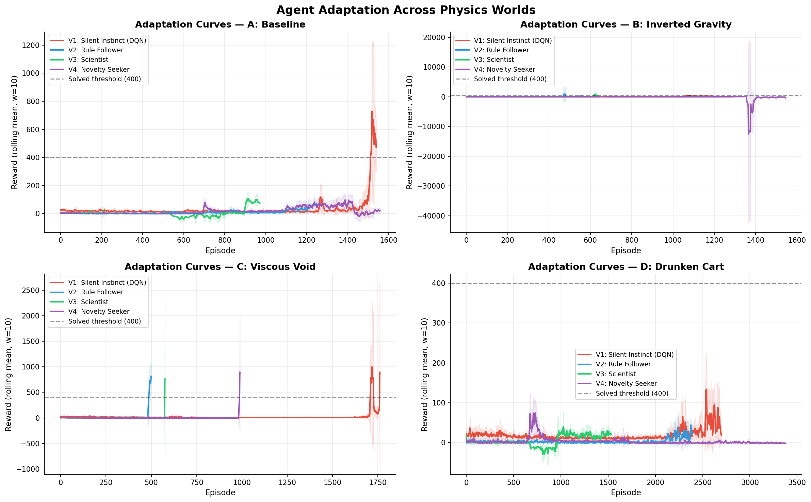
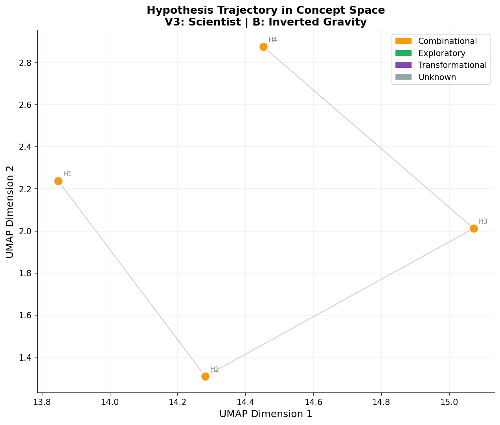
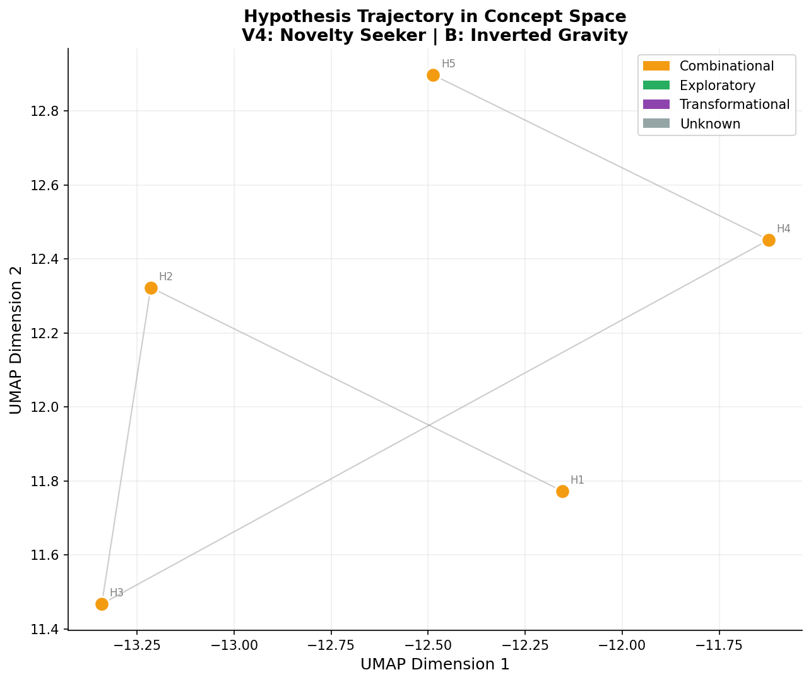

# Measuring Novelty in LLM-Guided Reinforcement Learning

**Can we quantify and enforce creative hypothesis generation in AI agents?**

This project investigates whether Large Language Models (LLMs) can generate genuinely novel hypotheses when coupled with Reinforcement Learning feedback, and if explicit novelty pressure leads to more creative problem-solving strategies.

## 🎯 Research Question

When an RL agent fails in a modified physics environment, can an LLM:
1. Generate a useful hypothesis about what changed?
2. Translate that hypothesis into a reward function?
3. Revise its theories iteratively based on performance feedback?
4. Be **explicitly pushed** toward more novel/creative hypotheses?

## 🧬 Why This Matters

Current LLMs often produce **combinational creativity** (recombining known patterns) but rarely achieve **transformational creativity** (inventing new conceptual frameworks). By measuring semantic novelty in hypothesis generation and enforcing diversity thresholds, we test whether we can push LLMs beyond their comfort zone into more exploratory and transformational reasoning.

---

## 📐 Experimental Design

### The Four Worlds

We test agents in CartPole environments with broken physics:

| World | Physics Modification | Challenge |
|-------|---------------------|-----------|
| **Baseline** | Standard gravity (9.8 m/s²) | Control condition |
| **Inverted** | Negative gravity (-9.8 m/s²) | Pole "falls" upward |
| **Viscous** | Zero gravity, high damping | Momentum-free motion |
| **Delayed** | 3-frame action delay | Temporal misalignment |

### The Four Agents

We compare architectures with increasing LLM integration:

| Agent | Architecture | Hypothesis Generation | Novelty Enforcement |
|-------|-------------|----------------------|---------------------|
| **V1: Silent Instinct** | Pure DQN | None (no LLM) | N/A |
| **V2: Rule Follower** | LLM → Reward → DQN | One-shot (no revision) | No |
| **V3: Scientist** | RL ↔ LLM loop | Iterative revision | No |
| **V4: Novelty Seeker** | RL ↔ LLM loop + rejection sampling | Iterative revision | **Yes** |

**Key Innovation (V4):** Before accepting a hypothesis, we compute its embedding distance from ALL previous hypotheses. If distance < 0.30 (cosine), the hypothesis is **rejected** and the LLM must try again with explicit feedback about why it was too similar.

---

## 🔬 Methodology

### Novelty Measurement

We use three complementary metrics:

1. **Linguistic Surprise** (Embedding Distance)
   - Embed hypotheses using `sentence-transformers/all-MiniLM-L6-v2`
   - Compute cosine distance: `1 - cosine_similarity(embedding_new, embedding_prev)`
   - Thresholds (empirically calibrated):
     - `Δ ≥ 0.70`: Transformational (completely different domains)
     - `Δ ≥ 0.50`: Exploratory (different causal mechanisms)
     - `Δ ≥ 0.30`: Combinational (moderately different)
     - `Δ < 0.30`: Too similar (rejected in V4)

2. **Boden Taxonomy** (LLM Self-Classification)
   - Ask LLM (via Groq) to classify its own hypothesis
   - **Combinational**: Recombining known strategies
   - **Exploratory**: Pushing boundaries of existing frameworks
   - **Transformational**: Inventing new conceptual spaces

3. **Behavioral Fingerprinting**
   - Hash discretized state-action trajectories
   - Detects when different hypotheses lead to identical behaviors

### RL-LLM Loop (V3 and V4)

```
1. LLM observes random-policy telemetry
2. LLM generates hypothesis about physics
3. LLM writes custom reward function
4. DQN trains using that reward
5. If performance < threshold:
   → Feed back failure diagnostics to LLM
   → LLM revises hypothesis
   → Repeat (4 revisions × 10k timesteps each)
```

**V4 addition:** Between steps 2-3, check novelty. If too similar → reject → retry with penalty feedback.

---

## 🚀 Setup & Run

### Installation

```bash
# Clone repository
git clone https://github.com/MansiDhanania/Novelty-in-LLM-Guided-RL.git
cd Novelty-in-LLM-Guided-RL

# Install dependencies
pip install -r requirements.txt

# Set up API key (Groq for LLM calls)
cp .env.example .env
# Edit .env and add your GROQ_API_KEY
```

### Quick Start

```bash
# Run single agent on one world (fast test)
python run_experiment.py --agent v4 --world inverted --timesteps 50000 --revisions 4

# Run full experiment (all agents × all worlds)
python run_experiment.py

# Generate plots from existing data
python run_experiment.py --plots-only

# Comparative Plots
python visualization/make_comparison_plot.py

# Launch interactive dashboard
streamlit run visualization/dashboard.py
```

### Commands Reference

```bash
# V1 (DQN baseline - no LLM)
python run_experiment.py --agent v1 --world baseline --timesteps 30000

# V2 (One-shot LLM)
python run_experiment.py --agent v2 --world inverted --timesteps 30000

# V3 (Iterative scientist)
python run_experiment.py --agent v3 --world viscous --timesteps 50000 --revisions 4

# V4 (Novelty-enforced scientist)
python run_experiment.py --agent v4 --world delayed --timesteps 50000 --revisions 4

# Clean old V4 data (if re-running with updated thresholds)
python cleanup_v4.py
```

---

## 📊 Results

### Performance Summary



**Agent Performance Across Worlds:**

| Agent | World | Episodes | Avg Reward | Max Reward | Notes |
|-------|-------|----------|------------|------------|-------|
| **V1 (DQN)** | Baseline | 1,540 | 32.3 | 2,000 | Best on baseline |
| | Inverted | 1,185 | 42.1 | 769 | Adapts via pure RL |
| | Viscous | 1,762 | 28.3 | 5,816 | Unstable learning |
| | Delayed | 2,698 | 18.5 | 275 | Struggles with delay |
| **V2 (Rule Follower)** | Baseline | 1,275 | 11.0 | 98.9 | One-shot insufficient |
| | Inverted | 555 | 33.8 | 7,919 | Lucky hypothesis |
| | Viscous | 500 | 31.0 | 1,234 | |
| | Delayed | 2,390 | 3.3 | 103 | Poor theory |
| **V3 (Scientist)** | Baseline | 972 | 3.4 | 224 | Over-optimization |
| | Inverted | 634 | 23.1 | 1,981 | Benefits from revision |
| | Viscous | 576 | 15.3 | 4,515 | |
| | Delayed | 1,533 | 5.0 | 133 | |
| **V4 (Novelty Seeker)** | Baseline | 1,558 | 18.2 | 195 | More exploration |
| | Inverted | 1,546 | -144.7 | 466 | High variance |
| | Viscous | 990 | 8.0 | 3,841 | |
| | Delayed | 3,379 | 3.3 | 185 | |

### Novelty & Diversity Metrics

| Agent | Hypotheses Generated | Avg Embedding Distance | Max Embedding Distance |
|-------|---------------------|------------------------|------------------------|
| **V2 (Rule Follower)** | 4 | 0.000 | 0.000 |
| **V3 (Scientist)** | 17 | 0.052 | 0.216 |
| **V4 (Novelty Seeker)** | 18 | **0.186** | **0.385** |

**→ V4 achieves 3.6× higher average novelty than V3**

### Hypothesis Evolution: V3 vs V4

**V3 Scientist (No Novelty Pressure)** — Hypotheses converge quickly:



**V4 Novelty Seeker (Enforced Diversity)** — Hypotheses explore wider space:



The V4 agent's hypotheses are visually more spread out in embedding space, confirming that the rejection sampling mechanism forces exploration of different conceptual frameworks.

### Example Hypothesis Progression (V4 on Inverted World)

| Phase | Hypothesis | Distance | Score |
|-------|-----------|----------|-------|
| 0 | "Balance requires centered cart and upright pole" | 0.00 | 0/100 (initial) |
| 1 | "Energy oscillation cycle dampened by friction" | 0.33 | 100/100 ✓ |
| 2 | "Oscillation frequency determines stability" | 0.25 | 100/100 ✓ |
| 3 | "Momentum disequilibrium needs counter-oscillation" | 0.27 | 100/100 ✓ |
| 4 | "Air resistance creates non-linear momentum interaction" | 0.42 | 100/100 ✓ |

Note: These were scored with old thresholds (0.10). With updated thresholds (0.30), only phases 1 and 4 would pass.

### Creativity Classification (Boden Taxonomy)

All agents currently classified as **combinational** by the LLM self-classifier:

| Agent | Combinational | Exploratory | Transformational |
|-------|---------------|-------------|------------------|
| V2 | 4 | 0 | 0 |
| V3 | 17 | 0 | 0 |
| V4 | 18 | 0 | 0 |

**Interpretation:** Even with higher novelty distances, V4's hypotheses are still recombining existing physics concepts (energy, momentum, oscillation) rather than inventing fundamentally new frameworks. This suggests the threshold for true transformational creativity is higher than semantic distance alone can capture.

---

## 🧠 Technical Details

### LLM Selection: Groq (Llama-3.1-8B)

We use **Groq's Llama-3.1-8B-Instant** for three reasons:
1. **Speed**: Sub-second inference enables real-time RL-LLM loops
2. **Cost**: Free tier sufficient for iterative experimentation
3. **Output Quality**: Reliably generates valid Python reward functions

Alternative considered: GPT-4 (better reasoning but 10× slower and expensive for 50+ hypothesis generations per run).

### Embedding Model: sentence-transformers/all-MiniLM-L6-v2

- **Size**: 80MB (fast CPU inference)
- **Dimensions**: 384-dimensional embeddings
- **Training**: Paraphrase detection on 1B+ sentence pairs
- **Benchmark**: Cosine similarity ~0.90 for near-identical text, ~0.10 for unrelated text

### Rejection Sampling (V4)

```python
for attempt in range(MAX_RETRIES):
    hypothesis = llm.generate()
    
    # Check against ALL previous hypotheses
    distances = [cosine_distance(hypothesis, prev) for prev in history]
    min_distance = min(distances)
    
    if min_distance >= MIN_NOVELTY_DISTANCE:  # 0.30
        accept(hypothesis)
        break
    else:
        # Show LLM its novelty score and why it failed
        llm.retry_with_feedback(
            score=novelty_score(min_distance),
            hint=generate_hint()
        )
```

### Database Schema

All runs logged to `logs/experiment.db`:

- **experiments**: Metadata (agent, world, config)
- **episodes**: Per-episode rewards and steps
- **hypotheses**: LLM-generated theories with embeddings
- **novelty_scores**: Linguistic surprise, Boden type, behavioral hash

Query example:
```sql
SELECT agent, AVG(linguistic_surprise), MAX(linguistic_surprise) 
FROM novelty_scores 
GROUP BY agent;
```

---

## 📁 Project Structure

```
RL_LLM/
├── agents/
│   ├── v1_dqn.py                # Baseline: Pure DQN (no LLM)
│   ├── v2_rule_follower.py      # One-shot LLM → Reward → RL
│   ├── v3_scientist.py          # Iterative RL ↔ LLM loop
│   └── v4_novelty_seeker.py     # V3 + novelty rejection sampling
├── environments/
│   └── cartpole_variants.py     # 4 physics-modified worlds
├── measurement/
│   ├── database.py              # SQLite logging
│   ├── novelty_scorer.py        # Embedding distance + Boden classifier
│   └── backfill_novelty.py      # Retroactive scoring
├── visualization/
│   ├── plots.py                 # All matplotlib figures
│   ├── dashboard.py             # Streamlit interactive UI
│   └── make_comparison_plot.py  # Side-by-side visualizations
├── logs/
│   └── experiment.db            # All experimental data
├── results/                     # Generated plots (PNG)
├── run_experiment.py            # Main experiment orchestrator
├── cleanup_v4.py                # Database cleanup utility
├── get_metrics.py               # Export summary statistics
└── requirements.txt
```

---

## 🔮 Future Work

1. **Higher-Order Novelty**: Test GPT-4 or Claude to see if better base models achieve exploratory/transformational creativity
2. **Reward Function Analysis**: Cluster generated reward functions to see if semantic novelty correlates with behavioral diversity
3. **Multi-World Transfer**: Test if hypotheses from one world generalize to others
4. **Human Evaluation**: Blind comparison of V3 vs V4 hypotheses by physics experts

---